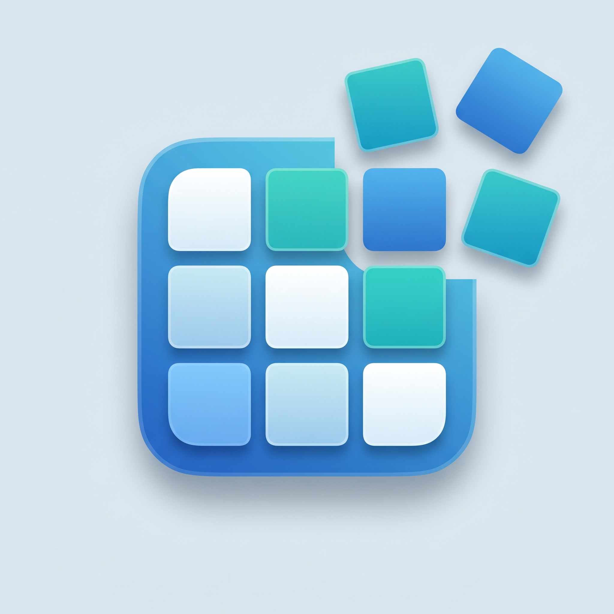

# Image Seperator

<p align="center">
  
</p>

A native SwiftUI macOS app that takes 16:9 images containing a 3×3 grid of frames and exports each of the 9 cells as an individual JPEG. Point it at a folder, review the thumbnails with the grid overlay, pick what you want, and export — each source image produces 9 numbered frames sharing a unique random code.

---

## Features

- Folder picker (sandbox-friendly `NSOpenPanel`) — scans for supported image types and shows a thumbnail grid.
- Adaptive `LazyVGrid` of 16:9 previews with an optional 3×3 guide overlay.
- Automatic aspect-ratio check — non-16:9 files are detected, dimmed, and clearly labeled; they can't be selected or exported.
- Manual per-image selection, plus **Select All** / **Deselect All** (⌘A).
- Parallel export (⌘E): each selected image is sliced into 9 cells using `CGImage.cropping`, written as JPEG at quality 0.92.
- Live export progress overlay (frames written / total frames).
- Concurrent, off-main loading and export via Swift `TaskGroup`.

## How the grid extraction works

Each source image is assumed to be 16:9 and to contain a 3×3 matrix of frames. Because `16/3 : 9/3 = 16:9`, every cell keeps the same aspect ratio as the whole. The app divides the source's pixel dimensions into thirds and crops 9 rectangles in row-major order, starting top-left:

```
┌───┬───┬───┐
│ 1 │ 2 │ 3 │
├───┼───┼───┤
│ 4 │ 5 │ 6 │
├───┼───┼───┤
│ 7 │ 8 │ 9 │
└───┴───┴───┘
```

## Output file naming

Each source image gets **one** random 6-character uppercase hex code, and its 9 frames share that code:

```
frame-<CODE>-01.jpg
frame-<CODE>-02.jpg
…
frame-<CODE>-09.jpg
```

Example output for two source images:

```
frame-8BA07E-01.jpg … frame-8BA07E-09.jpg    (from image A)
frame-3F12CC-01.jpg … frame-3F12CC-09.jpg    (from image B)
```

Re-exporting the same source produces a new code, so filenames don't collide across runs.

## Supported input formats

`.jpg`, `.jpeg`, `.png`, `.tif`, `.tiff`, `.heic`, `.heif`, `.bmp`, `.webp` — anything `CGImageSource` can read.

Files are filtered to a 16:9 aspect ratio with ±2% tolerance. Files outside that window are still listed (so you can see what was skipped) but are disabled for export.

## Requirements

- macOS 26.2 or later
- Xcode 26.3 or later (the project uses `PBXFileSystemSynchronizedRootGroup`, Swift 5 with `SWIFT_APPROACHABLE_CONCURRENCY`, and `SWIFT_DEFAULT_ACTOR_ISOLATION = MainActor`)
- Apple Silicon or Intel Mac

## Build & run

```bash
git clone https://github.com/kbirand/Image-Seperator.git
cd Image-Seperator
open Sperator.xcodeproj
```

Then hit ⌘R in Xcode. Or build from the command line:

```bash
xcodebuild -project Sperator.xcodeproj -scheme Sperator -configuration Debug build
```

The built app bundle is `Image Seperator.app`. The target/scheme/bundle-id are kept as `Sperator` internally; the user-facing name is set via `CFBundleDisplayName` and `PRODUCT_NAME`.

## Usage

1. Launch **Image Seperator**.
2. Click **Choose Folder…** and pick a folder containing your 16:9 grid images.
3. Each thumbnail renders at 16:9 with an optional 3×3 overlay (toggle **Show grid** in the toolbar).
4. Click individual thumbnails to toggle selection, or use **Select All** (⌘A).
5. Click **Export Selected…** (⌘E) and choose an output folder.
6. Watch the progress overlay; exported files appear in the chosen folder using the naming scheme above.

## Project structure

```
Sperator/
├── SperatorApp.swift        App entry point (WindowGroup → ContentView)
├── ContentView.swift        UI: toolbar, LazyVGrid, thumbnail view, overlay
├── GridImageItem.swift      Per-image model (URL, pixel size, thumbnail, selection)
├── GridServices.swift       GridImageLoader + GridExporter (off-main, parallel)
├── ImageGridModel.swift     @MainActor @Observable state + orchestration
└── Assets.xcassets          App icon & accent color
```

### Key types

| Type | Role |
| --- | --- |
| `GridImageItem` | Identifiable struct holding URL, pixel size, cached `CGImage` thumbnail, selection flag, and `is16x9` check. |
| `GridImageLoader` | `nonisolated` enum that enumerates the folder and loads thumbnails in parallel using `CGImageSource`. |
| `GridExporter` | `nonisolated` enum that performs the 3×3 crop and JPEG write; returns a `GridExportResult` per source. |
| `ImageGridModel` | `@MainActor @Observable` class coordinating folder/output pickers, loading, selection, and export progress. |

### Concurrency

- The view model runs on `MainActor`.
- Folder scanning, thumbnail decoding, and image splitting run on cooperative background tasks via `withTaskGroup`.
- Image splitting uses `CGImage.cropping(to:)` which shares the underlying pixel buffer — no full re-decode per cell.

## Entitlements

The app runs in the macOS App Sandbox with the Hardened Runtime enabled:

| Entitlement | Value |
| --- | --- |
| `com.apple.security.app-sandbox` | `true` |
| `com.apple.security.files.user-selected.read-write` | `true` (`ENABLE_USER_SELECTED_FILES = readwrite`) |

Read/write access is granted only for folders the user explicitly picks through `NSOpenPanel`; the app has no other filesystem access.

## Tech

- SwiftUI + `@Observable`
- AppKit (`NSOpenPanel`)
- `CoreGraphics` / `ImageIO` (`CGImageSource`, `CGImageDestination`)
- `UniformTypeIdentifiers` for the JPEG UTI
- Swift Concurrency (`Task`, `TaskGroup`, `nonisolated` helpers)

## License

No license specified yet. Add one if you plan to distribute.
